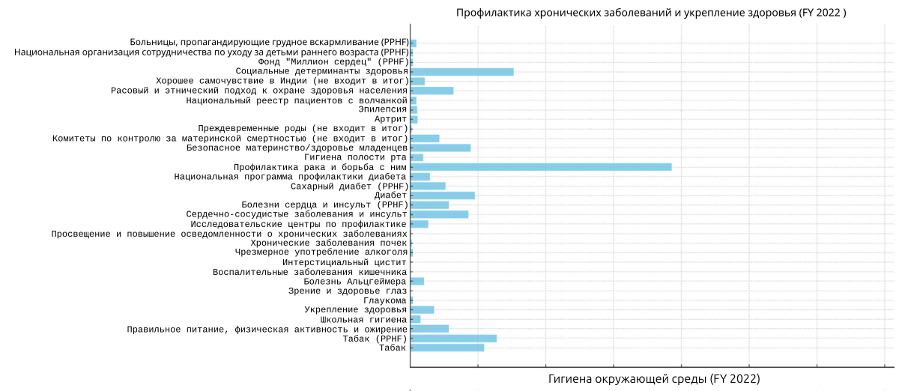
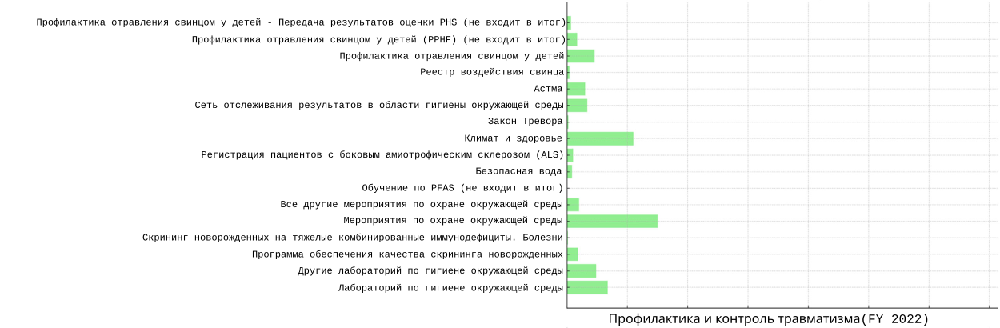
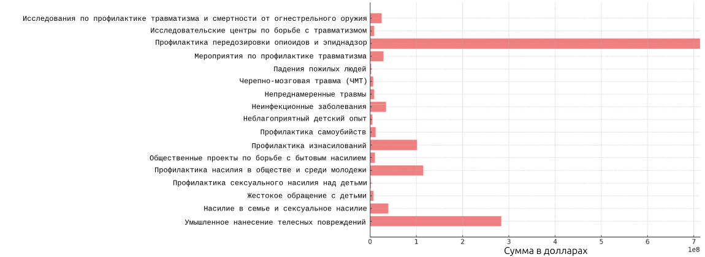
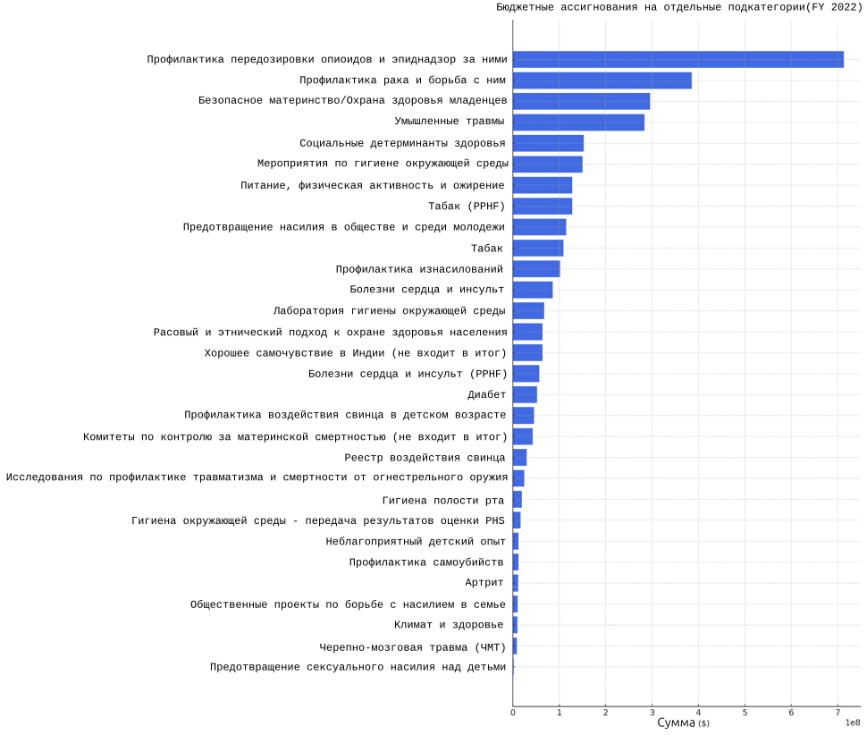

## Расходы на осведомлённость о сексуальном насилии над детьми

Мы можем измерить приоритеты общества по тому, как оно тратит деньги.

Итак…

Сексуальное насилие в детстве переживают примерно 1 из 3 девочек и 1 из 5 мальчиков.

33 % девочек, 20 % мальчиков…

И это наверняка сильно заниженные цифры, учитывая стигму сообщения — особенно для мальчиков.

Таким образом, на каждого взрослого курильщика приходится примерно три маленькие девочки и два маленьких мальчика, которые подвергаются сексуальному насилию в детстве.

Взрослые выбирают курить — дети всегда являются невольными жертвами сексуального насилия.

Сколько же тратит федеральное правительство США на осведомлённость, исследования и профилактику сексуального насилия над детьми? Эти данные крайне трудно доступны. То, что удалось найти:[^49]

- Инвестиции федерального правительства США в исследования профилактики сексуального насилия над детьми выросли с 0 долларов в 2019 году до 2 миллионов долларов к 2022 году.

- На каждые 3125 долларов, потраченных на наказание преступников, приходится всего 1 доллар на исследования профилактики.

Теперь посмотрим на бюджет CDC за 2022 год и сделаем сравнения:[^50]

[^50]

1. **Объяснение графика:** График визуализирует распределение бюджета по конкретным подкатегориям, связанным со здоровьем, в финансовом году 2022. Каждая горизонтальная полоса соответствует одной подкатегории, а длина полосы отражает объём выделенных средств.

2. **Что означает 1e8?:** Обозначение «1e8» на оси X — это научная нотация. Оно означает 1 × 10⁸, то есть 100 000 000. Такая запись часто используется в графиках для компактного представления очень больших чисел. В данном случае это масштаб в сотнях миллионов долларов.

3. **Что такое «не входит в итог»?:** «не входит в итог» обычно означает, что указанная сумма уже включена в какую-либо другую, более крупную строку бюджета, и её не следует прибавлять повторно, чтобы избежать двойного учёта. Это способ показать детализацию конкретной части бюджета без создания впечатления дополнительного финансирования.

4. **Что такое PPHF?:** PPHF расшифровывается как Prevention and Public Health Fund («Фонд профилактики и общественного здоровья»). Это обязательный источник финансирования, созданный в рамках Закона о доступном медицинском обслуживании (Affordable Care Act, часто называемого Obamacare), для поддержки мероприятий по общественному здоровью и профилактике.

5. **Почему две строки по табачной тематике?:** Существуют две отдельные бюджетные позиции, связанные с табаком:

	- **Tobacco:** эта статья может охватывать общие программы, инициативы или исследования, связанные с употреблением табака, его последствиями и профилактикой.
	
	- **Tobacco (PPHF):** это средства, выделенные конкретно из Фонда профилактики и общественного здоровья (PPHF) на мероприятия, связанные с табаком. Иными словами, часть бюджета по борьбе с табаком финансируется именно из этого специального фонда.

По сути, обе позиции касаются борьбы с табаком, но происходят из разных источников финансирования или направлены на разные инициативы в рамках более широкой программы контроля над табаком.

Теперь посмотрим на цифры:

- **Профилактика передозировки опиоидов и эпиднадзор:** 713 369 000 долларов  
- **Профилактика рака и борьба с ним:** 385 799 000 долларов  
- **Безопасное материнство/Охрана здоровья младенцев:** 295 799 000 долларов  
- **Умышленные травмы:** 283 550 000 долларов  
- **Социальные детерминанты здоровья:** 153 000 000 долларов  
- **Мероприятия по гигиене окружающей среды:** 150 600 000 долларов  
- **Питание, физическая активность и ожирение:** 128 100 000 долларов  
- **Табак (PPHF):** 128 100 000 долларов  
- **Предотвращение насилия в обществе и среди молодежи:** 115 100 000 долларов 
- **Табак:** 109 400 000 долларов  
- **Профилактика изнасилований:** 101 750 000 долларов  
- **Болезни сердца и инсульт:** 86 030 000 долларов  
- **Лаборатория гигиены окружающей среды:** 67 750 000 долларов  
- **Расовый и этнический подход к охране здоровья населения:** 63 950 000 долларов  
- **Болезни сердца и инсульт (PPHF):** 57 075 000 долларов  
- **Диабет:** 52 075 000 долларов  
- **Профилактика воздействия свинца в детском возрасте:** 46 000 000 долларов  
- **Комитеты по контролю за материнской смертностью (не входит в итог):** 43 000 000 долларов  
- **Реестр воздействия свинца:** 30 000 000 долларов  
- **Исследования по профилактике травматизма и смертности от огнестрельного оружия:** 25 000 000 долларов  
- **Гигиена полости рта:** 19 500 000 долларов  
- **Гигиена окружающей среды - передача результатов оценки PHS:** 17 000 000 долларов  
- **Неблагоприятный детский опыт:** 12 000 000 долларов  
- **Профилактика самоубийств:** 12 000 000 долларов  
- **Артрит:** 11 500 000 долларов  
- **Общественные проекты по борьбе с насилием в семье:** 10 500 000 долларов  
- **Климат и здоровье:** 10 000 000 долларов  
- **Предотвращение сексуального насилия над детьми:** 1 500 000 долларов  

Это распределение — после десятилетий исследований, доказывающих колоссальный вред насилия над детьми.

Это не призыв увеличивать федеральные расходы.  

Это просто зеркало реальных приоритетов общества.

[^49]: (Is the Federal Government Spending Enough to Prevent Child Sex Abuse?, 2022)
[^50]: (CENTERS FOR DISEASE CONTROL AND PREVENTION FY 2022 President's Budget, 2022)